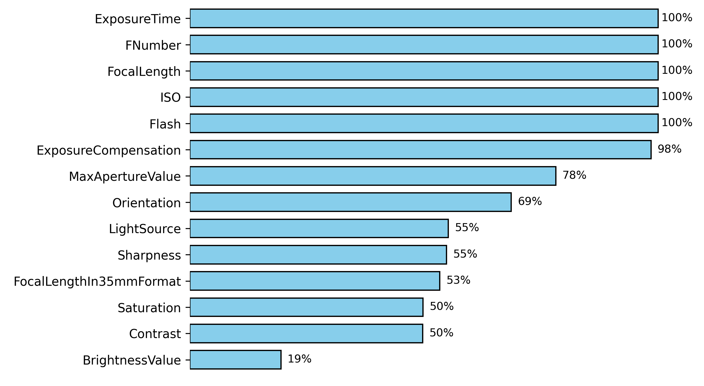
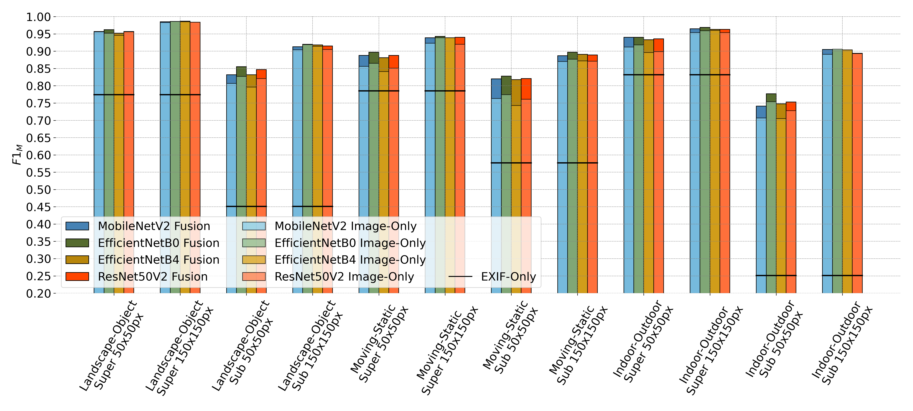
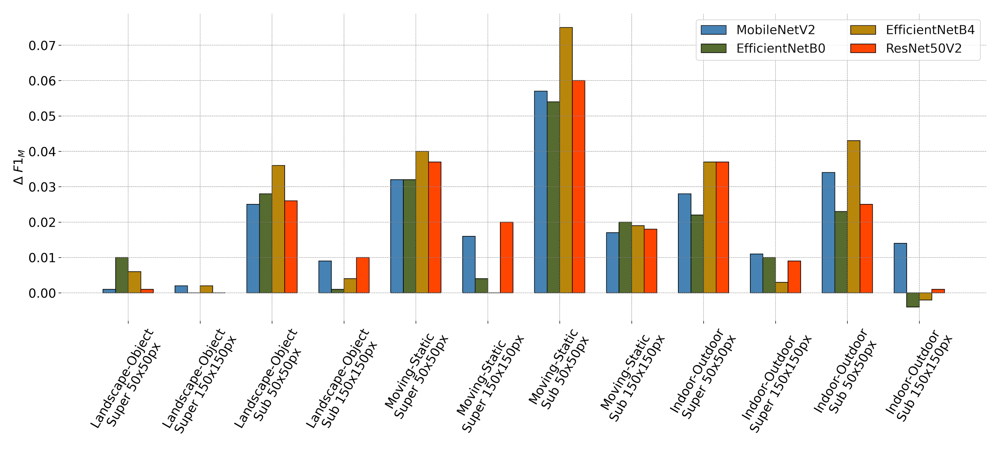
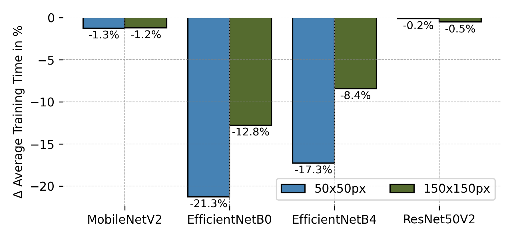
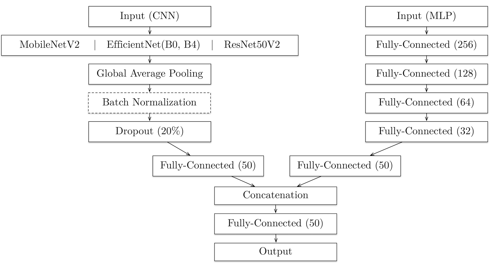

# Master Thesis Project - Ralf Lederer

In addition to photo data, many digital cameras and smartphones capture Exif metadata which contain information about the camera parameters used when a photo was captured. While most semantic image recognition approaches only use pixel data for classification decisions, this thesis aims to examine whether Exif data can improve image classification performed by convolutional neural networks (CNNs). The classification performance and training time of fusion models that use both, image data and Exif metadata, for image classification is compared to those of models that use only image data. In order to assess the usefulness of Exif data in various domains, the experiment is divided into three individual problem scenarios. Furthermore, each problem scenario is divided into various super-concepts and sub-concepts. The results show that the classification performance of fusion models could be increased in 46 of 48 cases compared to the baseline, while the improvement varies depending on the problem scenario and the image size used. The largest performance gain was obtained with a fusion model that increased the classification performance for the selected target concepts by 7.5%. The average training time of all fusion models could be reduced by 7.9%. An assessment of the importance of individual Exif tags showed that for the classification of individual target concepts different Exif tags are most important. 

# Training Concepts

Each image is assigned one or two labels, with the super-concept label always present and one optional sub-concept label. The table shows the concepts with the number of images for each concept. For non-unique sub-concepts the distribution to the two super-concepts is given.


| Super-concepts | Sub-concepts  |
|---|---|
| indoor (37887), outdoor (36473) | bathroom (2016), bedroom (2028), corridor (2041), kitchen (1997), office (2020), beach (2191), forest (2325), mountain (2116), river (2230), urban (2027), plant (5412,4897), dog (2963,3736), furniture (2388,2405), cat (3026,3183), portrait (2896,3511), sport (4387,4954) |
| moving (30386), static (28281) | boat (4022,3318), plane (1786,2837), motorcycle (2291,3169), car (3653,902) |
| object (23591), landscape (19395) | food (5000), furniture (2388), toys (6203), vehicle (5000), beach (2191), forest (2325), mountain (2116), skyline (7763) |


Exif tag distribution:




Note: The Flickr photo metadata to download the corresponding photos and their Exif data are located in **[Flickr Photo Metadata](/Flickr Photo Metadata/)**

# Overall Results

**F1-Scores**:

Macro F1-scores of fusion models and baseline models for each problem scenario and image resolution (reached on the test set).




**F1-Delta**:

Macro F1-score delta of fusion models compared to image only models (reached on the test set).




**Training Times**:

Total average training time delta of fusion models compared to baseline models.



# Technical Documentation

## Development Environment

The programming language of the project is [Python](https://www.python.org/), version **3.8.13**. In addition, the following packages are used:

- [TensorFlow 2.9.2](https://pypi.org/project/tensorflow/2.9.2/)
- [Keras 2.9.0](https://pypi.org/project/keras/2.9.0/)
- [Numpy 1.22.4](https://pypi.org/project/numpy/1.22.4/)
- [SciPi 1.8.1](https://pypi.org/project/scipy/1.8.1/)
- [Pandas 1.4.2](https://pypi.org/project/pandas/1.4.2/)
- [Pillow 9.1.1](https://pypi.org/project/Pillow/9.1.1/)
- [AIOHTTP 3.8.1](https://pypi.org/project/aiohttp/3.8.1/)
- [AIOFiles 0.8.0](https://pypi.org/project/aiofiles/0.8.0/)
- [PsUtil 5.9.1](https://pypi.org/project/psutil/5.9.1/)
- [SciKeras 0.9.0](https://pypi.org/project/scikeras/0.9.0/)
- [MatPlotLib 3.5.2](https://pypi.org/project/matplotlib/3.5.2/)
- [PyDot 1.4.2](https://pypi.org/project/pydot/1.4.2/)
- [Scikit-Learn 1.1.2](https://pypi.org/project/scikit-learn/1.1.2/)
- [GraphViz 0.20.1](https://pypi.org/project/graphviz/0.20.1/)

It is possible to set up the development environment manually, however, it is recommended to use the provided [Docker](https://www.docker.com/) containers.

## Project Structure

The source code of the project is located in **[src](/Implementation/src/)**, the main entry points for the different applications in **[Main](/Implementation/src/Main/)**. To be able to execute code from src, the directory must first be added to the **PYTHONPATH** environment variable:

```sh
export PYTHONPATH=$PYTHONPATH:/path/to/src
```

## Flickr Crawler

The Flickr crawler is used to export image and Exif data from the image portal [Flickr](https://flickr.com/) and provides two basic functionalities. Photos can either be exported directly from [Flickr groups](https://www.flickr.com/groups) or by conducting a free-text search using an arbitrary search term. Groups are identified by a unique ID and contain photos related to a particular topic. In some groups, only photos that exclusively show the group's topic may be uploaded. In other groups, however, it is also allowed to upload photos that contain objects that are not directly related to the group’s main topic, e.g. in the background of a photo. Therefore, and since the group rules are enforced with varying degrees of strictness, it can be assumed that training data collected from groups contain a certain amount of noise. When a free text search is performed, the Flickr API returns photos whose title, description or user tags contain the corresponding search term. User tags are keywords used to succinctly describe the content of photos. They can be added by authors. In addition, user tags are automatically determined and added by Flickr robots. The retrieved photos are then sorted according to their relevance determined by Flickr. Since Flickr does not define strict rules for photo titles, descriptions and user tags, and the way Flickr determines the relevance of photos for search terms is unknown, it can be assumed that training data collected via free text search also contains a certain amount of photos that do not match the desired target concept. Thus, training data collected with the Flickr crawler is always subject to noise if no further cleaning is performed.

The crawler application can be executed via the command line, using the main entry point in **[FlickrCrawlerMain.py](/Implementation/src/Main/FlickrCrawlerMain.py)**. The crawler is invoked with a command line parameter, which determines the function to be executed, either a group export or a free text search. Additionally, Exif data can be exported. The crawler offers the possibility to crawl an existing metadata file with image IDs, secrets and server information. In order to use the crawler, a valid [API-Key](https://www.flickr.com/services/api/misc.api_keys.html) is required.

The crawler saves the crawled images and Exif data in the following directory structure. Exif tags are saved in [JSON](https://www.json.org/json-en.html) file format:

```
OutputDir
│
│
│
└───images
│   │   {ImageId1_Secret_Server}.jpg
│   │   {ImageId2_Secret_Server}.jpg
│   │   ...
│
└───exif
    │   {ImageId1}.json
    │   {ImageId2}.json
    │   ...
```

The following functions and parameters can be used (the order of the parameters is arbitrary):

**Group Export**

```sh
python FlickrCrawlerMain.py -group 	# 'groupId' of the Flickr group to crawl
```

**Free-Text Search**

```sh
python FlickrCrawlerMain.py -search 	# 'search term' to use for searching photos
```

required parameters:
| parameter  | description  |
|---|---|
| -key | Flickr api key |
| -odir | directory for storing crawled photos and exif data |

optional parameters:
| parameter  | description  |
|---|---|
| -sp | start page of the group |
| -pl | page limit |
| -ppp | photos per group page (default 500) |
| -ft | additional filter tag for photos |
| -om | if set, only metadata will be crawled, no photos or exif data |
| -sm | path for storing crawled metadata file (needed when -om is set) |
 * all parameters of the 'photos' function, see below, only if -om is not set

**Metadata Export**

```sh
python FlickrCrawlerMain.py -photos 	# 'path' to metadata file containing photoIds, secrets and servers
```

required parameters:
| parameter  | description  |
|---|---|
| -odir | directory for storing crawled photos and exif data |
| -key | Flickr api key (only if exif data is to be crawled) |

optional parameters:
| parameter  | description  |
|---|---|
| -exif | if set, exif data will be crawled |
| -re | list of (required) exif tags photos must provide, separated by ',' |
| -ps | size of the crawled photos (default: ' ')<br />possible values: ['s', 'q', 't', 'm', 'n', 'w', 'z', 'c', 'b', 'h', 'k', '3k', '4k', 'f', '5k', '6k', 'o', ' ']<br />see: https://www.flickr.com/services/api/misc.urls.html |

**Examples**

Free-Text search for 'outdoor dog'. The start page is set to 1 and the page limit to 50, which is a total of 25000 images (500 images per page). However, only images that provide Exif data will be crawled and the Exif data must contain the Exif tags FocalLength, ISO, FNumber, ExposureTime and Flash. The image size key is set to 'q' = 150x150px. 

```sh
python FlickrCrawlerMain.py 
-search 'outdoor dog'
-key some_api_key
-exif
-ps q
-re FocalLength,ISO,FNumber,ExposureTime,Flash
-odir /path/to/store/image/and/exif/data
-sp 1
-pl 50
```

Group export for group with ID '44176395@N00'. The start page is set to 1 and the page limit to 100, which is a total of 50000 images (500 images per page). The image size key is set to 'q' = 150x150px. 

```sh
python FlickrCrawlerMain.py 
-group 44176395@N00
-key some_api_key
-ps q
-odir /path/to/store/image/and/exif/data
-sp 1
-pl 100
```

## Model Training

The usefulness of Exif data for image classification is evaluated by comparing the classification performance of baseline models to that of fusion models. Baseline models classify photos using only one image data, whereas fusion models use Exif data and image data. Furthermore, models based only on Exif data can be created. 

### Training with Exif data

For image classification with Exif data, a fully-connected, deep neural network with four hidden layers is used. The architecture is individually adapted to the respective classification task based on the used training data. The number of neurons in the input layer is based on the number of Exif tags used for classification. The output layer contains as many neurons as there are target concepts in the training data. The first hidden layer contains 256 neurons, with the number of neurons in each subsequent layer being halved. All hidden layers use a RELU (rectified linear unit) activation function. The activation function of the output layer is determined based on the training data. The softmax activation function is used for multi-class classification (2 output neurons) and the sigmoid activation function is used for multi-label classification.

### Training with image data

A Convolutional Neural Network (CNN) is used for classification based on image data. To facilitate the training process and shorten the training time, transfer learning is used, in which an already trained CNN model is adapted to a new classification task. First, the model architecture is extended with a new classification head that is suitable for the new classification task. As with the Exif-only model, the size of the output layer is automatically determined depending on the number of training concepts in the training dataset. Then, the new classification head is trained without adapting the weights of the pre-trained model for a certain number of epochs. In the subsequent fine-tuning phase, the weights of the top layers of the pre-trained model are adjusted to detect features present in images which are important for the new classification task. For this purpose, the weights of the top layers are trained for a certain number of epochs. Since high-level image features are recognized in the top layers of a CNN, it is sufficient to adjust only a certain number of layers of the pre-trained model, depending on the models depth. The CNN model can be created using the state-of-the-art architectures EfficientNet, MobileNet and ResNet (check: [Keras Appliations](https://keras.io/api/applications/) for more details), which are then initialized with pre-trained weights of the [ImageNet](https://www.image-net.org/challenges/LSVRC/) competition to enable [transfer learning](https://keras.io/examples/vision/image_classification_efficientnet_fine_tuning/). The architectures differ in terms of model depth, number of parameters, and the used network blocks. The more parameters a network architecture has, the longer is usually the required training time.

### Training with Exif & image data

A fusion model combines a CNN used for classification based on image data and a MLP used for classification based on Exif data by concatenating the output layers of both models and adding a new classification head. The concatenation layer feeds the combined output into an additional fully connected layer before the final classification is performed in the output layer of the new classification head of the mixed model.

**Fusion Model - Architecture**:




The training process of the different models can be carried out using the application in **[TrainingMain.py](/Implementation/src/Main/TrainingMain.py)** which can be started by executing the following command:

```sh
python TrainingMain.py 
```

In order to control the training process, the following command line parameters can be used:

required parameters:
| parameter  | description  |
|---|---|
| -name | output name of the final model |
| -datapath | paths to the zip files containing the training data, comma-separated |
| -outpath | path to the directory to store the created model / evaluation files |
| -bs | batch size to use for training |
| -epochs | number of epochs to use for training |
| -esepochs | number of early stopping patience epochs to use for training |

optional parameters:
| parameter  | description  |
|---|---|
| -cachepath | path to the caching directory |
| -super | if set, uses super concepts for training |
| -filter | list of concepts to be filtered from the input data source, comma-separated |
| -seed | random seed to use for training |
| -io | training will be performed with image data only |
| -eo | training will be performed with exif data only |
| -trainsize | amount of training data to use for training, default = 0.7 |
| -valsize | amount of training data to use for validation, default = 0.2 |
| -testsize | amount of training data to use for testing, default = 0.1 |
| -tformat | data format of the training data [flickr, mirflickr], comma-separated for multiple zip-files, default = flickr |
| -optimize | optimization criteria [accuracy, loss], default = loss |
| -all | if set, Exif-only, image-only and fusion models will be created using default learning parameters and the default<br />CNN architectures: EfficientNetB0, EfficientNetB4, MobileNetV2 and ResNet50V2 (see also: **[source file](/Implementation/src/Main/TrainingMain.py)**)  |

required parameters for image only & mixed model training:
| parameter  | description  |
|---|---|
| -size | image size to use (width/height), comma-separated |
| -tuneepochs| number of fine-tune epochs to use for training (transfer-learning) |
| -tunelayers | number of fine-tune layers of the model (transfer-learning) |
| -basemodel | CNN architecture to use for transfer-learning<br />if not set, four models will be trained using **EfficientNetB0** & **EfficientNetB4** & **MobileNetV2** & **ResNet50V2**<br />possible values: EfficientNetB0, EfficientNetB1, EfficientNetB2, EfficientNetB3, EfficientNetB4, EfficientNetB5,<br />EfficientNetB6, EfficientNetB7, MobileNetV2, ResNet152V2, ResNet101V2, ResNet50V2 |

optional parameters for Exif training (note: cannot be used when '-io' is set):
| parameter  | description  |
|---|---|
| -tags | list of Exif tags to use for training, comma-separated |
| -permutations | number of permutations used to assess the feature importance of Exif tags, default = 50 (only when '-eo' is set) |

**Examples**

Train an Exif data only model using super concepts.

```sh
TrainingMain.py 
-name LandscapeObjectSuperExifOnly
-datapath resources/landscape_object_multilabel.zip 
-cachepath resources/ 
-outpath models/ 
-bs 128 
-epochs 300 
-esepochs 50 
-eo
-super 
-optimize loss
-permutations 50
```

Train an image data only model using sub concepts. Since the parameter '-basemodel' is not set, the application will generate three models using the architectures EfficientNetB4, MobileNetV2 and ResNet50V2.

```sh
-name IndoorOutdoorImageOnly
-datapath resources/indoor_outdoor_multilabel.zip
-cachepath resources/ 
-outpath models/ 
-bs 32 
-epochs 115 # total epoch count
-esepochs 10 -io 
-tuneepochs 100 # fine-tune epoch count
-tunelayers 50 # fine-tune layer count
-size 150,150
-optimize loss
```

Train a mixed model using EfficientNetB5 base architecture for the CNN.

```sh
-name IndoorOutdoorScMixed
-datapath resources/indoor_outdoor_multilabel.zip 
-cachepath resources/ 
-outpath models/ 
-bs 32 
-epochs 115
-esepochs 20 
-tuneepochs 100
-tunelayers 50 
-size 150,150
-optimize loss
-basemodel EfficientNetB5
```

## Docker Containers

[Docker](https://www.docker.com/) is used to modularize and simplify the training process of the models. In addition, using docker containers enables easy portability since the containers can be run on all machines with a Docker deamon. 

### Base Image

The base image serves as the foundation for all containers and contains the source code, as well as all required libraries and frameworks to run the training application. It executes the Python interpreter on startup, allowing any Python application to be started via container commands. The dependencies and the behavior of the base image is defined in **[DockerFile](/Implementation/Dockerfile)**. It can be built using the docker-compose file **[docker-compose-build-base.yaml](/Implementation/docker-compose-build-base.yaml)** executing the following command:

```sh
docker-compose -f docker-compose-build-base.yaml build
```

The created image will be named: **ma-lederer-base**. After building, the image can be used to create docker containers.

### Volumes

Due to the ephemeral nature of docker containers, training data and model storage locations are only referenced using volumes instead of storing the files directly within the container. For the training of models two volumes are used. One for providing training data and as cache location (**ma-lederer-training-data**) and one for storing the created models (**ma-lederer-models**). The volumes are automatically created when starting a training task using docker-compose. However, the file locations need to be adjusted when porting the docker-compose files to another system.

### Training Tasks

For each training dataset, there is a docker-compose file that contains the definitions for individual training tasks. Each file contains a container specification for training exif-only, image-only and mixed-models.

**Example:**

The object/landscape dataset can be trained on super-concepts or on sub-concepts. The corresponding docker-compose file **[docker-compose-landscape-object-gpu.yaml](/Implementation/docker-compose-landscape-object-gpu.yaml)** provides the following container specifications:

- train-exif-only-landscape-object-super
- train-exif-only-landscape-object
- train-image-only-landscape-object-super
- train-image-only-landscape-object
- train-mixed-landscsape-object-super
- train-mixed-landscsape-object
- train-all-landscsape-object-super-150
- train-all-landscsape-object-super-50
- train-all-landscape-object-150
- train-all-landscape-object-50

In order to run a specific training task, the following command can be executed:

```sh
docker-compose -f docker-compose-landscape-object.yaml up -d 'training-task-name' #-d detaches the terminal from the container
```

Each container starts the training application using appropriate command line parameters, e.g. the specification of the container 'train-mixed-landscsape-object' is as follows:

```sh
train-mixed-landscsape-object:
    image: ma-lederer-base
    command: src/Main/TrainingMain.py 
             -name LandscapeObjectMixed 
             -datapath resources/landscape_object_multilabel.zip  
             -cachepath resources/ 
             -outpath models/ 
             -bs 32 
             -epochs 115 
             -esepochs 10 
             -tuneepochs 100 
             -tunelayers 50 
             -size 150,150
             -optimize loss
    volumes:
      - ma-lederer-training-data:/resources/
      - ma-lederer-models:/models/
    deploy:
      resources:
        reservations:
          devices:
            - capabilities: [gpu] 
```
